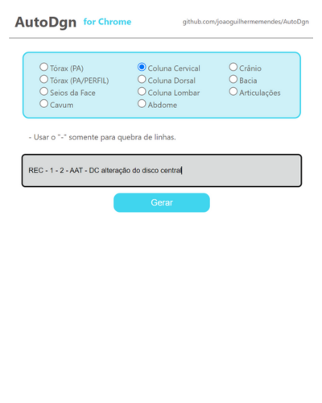
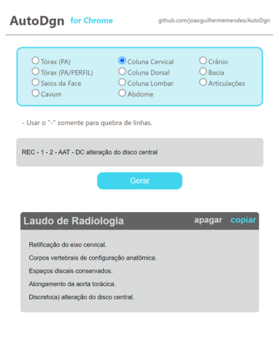

# AutoDgn
Ferramenta que usa um banco de siglas e significados para tornar mais rápida a escrita de laudos de radiologia.

## Exemplos
   

## Começando...
1. Para executar em desenvolvimento local ou rodar a partir do código-fonte:
```
    git clone https://github.com/joaoguilhermemendes/AutoDgn.git
```

2. Para transformar este código em uma extensão do Chrome:
    * Acesse a [página de extensões do Chrome](chrome://extensions/)
    * Ative o botão de `Modo do desenvolvedor` 
    * Clique em `Carregar sem compactação`
    * Selecione a pasta clonada
    * Clique no ícone da extensão >  Fixar
    
## Conceito
Durante o ano de 2023, eu trabalhei em um hospital.
Uma das funções mais desnecessariamente longas e trabalhosas (e diária), era digtar os laudos de raio-x. Ou melhor, reescrever os laudos de forma mais completa.
O médico radiologista disponibilizou uma lista de siglas e texto correspondente em excel e mandava todos os dias diversas siglas referentes a cada raio-x. Para ficar mais claro, vou descrever como era o passo a passo para digitar os laudos:
1. Paciente tirava o Raio-X
2. A imagem era enviada para o médico (normalmente com observações pertinentes)
3. O médico retornava a imagem, junto a algumas siglas (por exemplo: DC alteração do disco central)
4. Abria-se um documento de digitação e selecionava o tipo de radiografia (Seios da Face, Tórax PA, Cavum...) – que vinha com algumas linhas já completas e numeradas.
5. Sabendo o tipo de raio-x, abria-se o arquivo Excel e substituía-se as siglas pelo texto equivalente completo. 
6. Era formatado corretamente, e entregue ao paciente.

### Exemplo 01: 
```REC``` 
Retificação do eixo cervical 

Quando se pensa nisso feito para um exemplo simples como o listado acima, parece razoável. Porém, existiam alguns laudos com muitas siglas e além disso, haviam muitos laudos por dia.

### Exemplo 02:
```REC - 1 - 2 - AAT - DC alteração do disco central``` \
Retificação do eixo cervical. \
Corpos vertebrais de configuração anatômica. \
Espaços discais conservados. \
Alongamento da aorta torácica. \
Discreto(a) alteração do disco central. 

A maneira que eu resolvi usar para simplificar isso um pouco, foi criar um lugar onde eu poderia colar a linha enviada pelo radiologista, e isso me gerar o texto completo. Substituindo todos as siglas e adequando ao número de linha do tipo de radiologia correto. Uma solução simples que não tive muito tempo para refinar ainda.


